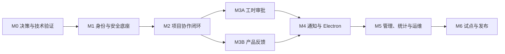

# 一期小步执行计划

- 状态：Ready for execution
- 适用范围：YumpooConsole 一期 M0–M6
- 基线来源：[阶段路线图](./00-roadmap-and-dependencies.md)、[需求追踪矩阵](./requirement-traceability-matrix.md)、[前端设计规范](../03-frontend/README.md)、`10-modules`、`20-cross-cutting`、`30-operations`、`40-quality`
- 使用方式：按依赖逐项领取；一项对应一个可评审、可验证的变更集

## 1. 计划口径

1. 本计划不裁剪一期范围，只把现有 M0–M6 里程碑拆成更小的交付单元。
2. 每一步建议控制在 0.5–2 人日：`XS` 约 0.5 人日，`S` 约 1 人日，`M` 约 2 人日。估算不含等待外部账号、试点自然周等日历时间。
3. 若领取后确认超过 2 人日，应按“迁移/领域规则/API/UI/自动化测试”继续拆分，不能把未完成部分藏在同一步中。
4. 步骤编号表达依赖顺序，不等同于 Sprint 或自然日期。排期应在团队人数、可用环境和并行能力确认后另行生成。
5. 原始初版仅用于追溯；实现以正式需求、领域设计、API/验收和 ADR 为准。

主依赖保持不变：

## 2. 单步统一完成定义

每一步只有同时满足以下条件才可勾选完成：

- 需求 ID、设计位置、接口或运维入口和验收证据能够互相追踪。
- 数据变化通过新增 Flyway 迁移完成，空库升级和已有库向前升级均通过。
- 写操作已覆盖授权、状态、`If-Match`/幂等、审计与 Outbox 规则；失败不会留下半成品业务事实。
- 后端契约、OpenAPI 和生成的 TypeScript 类型同步；没有第二套手写 DTO。
- 至少完成本步适用的领域单测、真实 PostgreSQL 集成测试、API 契约测试或 UI/Electron 自动化测试。
- 越权、并发、重试、失败和敏感信息泄露场景与正常路径一起验证。
- 需求追踪矩阵或阶段证据索引已更新；演示不依赖手工改库。

## 3. 已关闭的开工依赖

以下事项已由 [M0-01 差异登记](./M0-01-requirement-design-gap-register.md) 全部关闭。表中是后续实现的唯一冻结答案，不再是待选方案；如需改变，必须以替代 ADR 重新打开门禁并同步追踪矩阵。

| 类别 | 已冻结答案与证据 | 受影响步骤 |
| --- | --- | --- |
| 阶段边界 | M1 交付身份、会话和企业/平台角色；真实 Product/Project membership、owner 与资源权限集成在 M2 验证。见 [M0-02](./M0-02-module-ownership-and-orchestration.md) 与 [ADR-006](../90-decisions/ADR-006-module-ownership-and-orchestration.md) | M1-08、M2-05、M2-24 |
| 提醒阶段 | `WLG-REQ-029`～`033` 在 M3A 交付规则、资格查询与事件契约，M4 完成调度、投递并最终 Verified。见 [M0-04](./M0-04-time-calendar-and-metrics.md) | M3A-12、M4-06、M4-07 |
| 事件基础 | 事件信封、事务 Outbox 和消费幂等在 M0-11 前置；M4 只增加通知消费与投递。见 [M0-01](./M0-01-requirement-design-gap-register.md) | M0-11、M2-23、M3A-12、M3B-10、M4-01 |
| 模块归属 | 各业务/技术事实只有一个拥有模块；`administration.application` 只经公开端口编排 Project 原子初始化和带生命周期守卫的归档。见 [M0-02](./M0-02-module-ownership-and-orchestration.md) 与 [ADR-006](../90-decisions/ADR-006-module-ownership-and-orchestration.md) | M0-02、M2-04～M2-08、M5-10 |
| API 语义 | 既有资源写只使用强 ETag/`If-Match`；401/403/404/412/428、专用命令和必填日期范围按统一契约实现。见 [M0-03](./M0-03-api-concurrency-and-auth-semantics.md) 与 [ADR-007](../90-decisions/ADR-007-api-concurrency-and-auth-semantics.md) | M0-03、各阶段 API 步骤 |
| Feedback/协作 | Update 分模块拥有，Activity 使用 PROJECT/PRODUCT/FEEDBACK 安全投影；附件采用意图、隔离上传、扫描、发布和实时鉴权的单一路径。见 [M0-05](./M0-05-activity-feedback-update-and-attachments.md) 与 [ADR-009](../90-decisions/ADR-009-activity-feedback-update-and-attachments.md) | M2-18～M2-20、M3B-08～M3B-09 |
| 时间与统计 | Company 使用可配置 IANA 时区和公司日历；周、提醒、截止、四类状态及每项指标公式按单一版本执行。见 [M0-04](./M0-04-time-calendar-and-metrics.md) 与 [ADR-008](../90-decisions/ADR-008-time-calendar-and-metrics.md) | M1-01、M3A-12、M5-01 |
| 运维与桌面 | 分层备份、HMAC actorRef、远程 HTTPS SPA、SSE+ACK 和统一容量数据集按单一基线实施。见 [M0-06](./M0-06-operations-electron-and-performance.md) 与 [ADR-010](../90-decisions/ADR-010-operations-electron-and-performance.md) | M4-09～M4-13、M5-11～M5-18 |

## 4. M0：决策冻结与高风险验证

来源：[M0 阶段文档](./M0-requirement-freeze-and-spikes.md)。M0 的目标是消除会导致返工的歧义，并产出可由第二人复现的技术验证，不交付完整业务页面。

M0 采用“开发门禁 + 环境门禁”两层验收。M0-01～M0-18 的开发门禁已于 2026-08-13 完成；下表的 `[x]` 不表示对应 live 证据已经通过。真实企业微信 OAuth、公司 HTTPS、目标 Windows Server、IIS、服务账号和目录 ACL 等环境证据可保持 `NOT_RUN`，不会阻塞本地开发；真实企微 OAuth、扫码与鉴权统一在 M6-01 补验，其他环境项按延期清单进入 M5/M6 门禁。模拟结果不得标记为 live `PASS`。

| 步骤 | 小步产出 | 完成证据 | 前置 | 规模 |
| --- | --- | --- | --- | --- |
| [x] M0-01 | [建立需求—设计—API—验收差异清单](./M0-01-requirement-design-gap-register.md) | GAP-001～GAP-016 均有影响范围、决策角色、门禁、回写和 CLOSED 证据 | 无 | S |
| [x] M0-02 | [冻结模块数据归属与跨模块编排](./M0-02-module-ownership-and-orchestration.md) | ADR-006/架构文档明确唯一归属、公开端口、Project 原子初始化和归档守卫 | M0-01 | S |
| [x] M0-03 | [统一 API 并发、版本与认证错误语义](./M0-03-api-concurrency-and-auth-semantics.md) | ADR-007 只保留强 ETag/If-Match；401/403/404/412/428、专用命令和日期契约唯一 | M0-01 | S |
| [x] M0-04 | [冻结时区、工作日历、提醒和统计口径](./M0-04-time-calendar-and-metrics.md) | ADR-008 对时区、自然周、提醒/截止、四状态、分子分母和空值均给出样例 | M0-01 | S |
| [x] M0-05 | [冻结 Activity、Feedback Update 和附件流程](./M0-05-activity-feedback-update-and-attachments.md) | ADR-009 对共享流、提及/治理、侧别投影、附件状态机和扫描事务边界给出验收 | M0-01 | S |
| [x] M0-06 | [冻结备份、日志、Electron 与压测口径](./M0-06-operations-electron-and-performance.md) | ADR-010 对保留、日志主体、SPA、SSE/ACK 和目标负载各保留一个答案 | M0-01 | S |
| [x] M0-07 | 建立 Spring 模块、Vue SPA、Electron 壳和目录骨架 | Maven Wrapper/Node 锁文件可构建；ArchUnit 阻止非法模块依赖 | M0-02 | M |
| [x] M0-08 | 建立 PostgreSQL、Flyway 和真实库测试骨架 | 空库迁移、重复校验、Testcontainers/测试库用例通过 | M0-07 | S |
| [x] M0-09 | 建立 `/api/v1`、统一错误、requestId、分页及 TS 客户端生成 | 400/401/403/404/409/412/422/426/428 契约样例和生成客户端编译通过 | M0-03、M0-07 | M |
| [x] M0-10 | 实现乐观锁与幂等记录最小闭环 | 同版本并发仅一次成功；同键同体重放、同键异体冲突通过 | M0-08、M0-09 | M |
| [x] M0-11 | 实现事件信封、事务 Outbox、消费幂等及审计/日志最小骨架 | 业务回滚不留事件；重复消费不重复；requestId 可贯穿 | M0-08、M0-10 | M |
| [x] M0-12 | 完成企微 OAuth 回调安全骨架与本地协议验证 | 受控适配器下 corp/member 映射、state/nonce、伪造/重放拒绝可重复；真实企业 OAuth 证据保持 `NOT_RUN`，在 M6-01 部署/发布环境门禁补验 | M0-09 | M |
| [x] M0-13 | 验证企微通讯录分页、部分失败、离职与重试 | 中途失败不误判离职；重跑不重复建人；记录外部限制；不依赖 M0-12 live `PASS` | M0-12（开发门禁） | M |
| [x] M0-14 | 验证接近 100 MB 的隔离上传、类型识别、查毒和原子转正 | 受限堆内存与失败关闭自动化通过；真实 Defender/NTFS 证据按可用环境补验，不阻塞开发门禁 | M0-05、M0-08 | M |
| [x] M0-15 | 验证 Electron 浏览器交接协议和安全壳 | Windows 包/manifest、handoff 单次/过期、state/PKCE、Node/导航/IPC 自动化通过；M4-14 只验证受控身份提供者下的本地语义，真实企微浏览器登录与公司 HTTPS 延至 M6-01 | M0-06、M0-12（开发门禁） | M |
| [x] M0-16 | 固化 Windows 部署资产并完成本地运行验证 | 本地回环监听、liveness/readiness 和配置校验通过；IIS/HTTPS、仅 443、ACL、低权限服务账号和整机重启形成清单，目标机实测延至 M5-14/M6 | M0-07～M0-09 | M |
| [x] M0-17 | 完成本地数据库与附件成套备份、隔离恢复原型 | 使用合成数据验证 manifest/校验值一致、抽样引用和附件可读；外部介质、计划任务及 RPO/RTO 演练延至 M5-15/M6 | M0-08、M0-14 | M |
| [x] M0-18 | 建立最小 CI 与 M0 开发证据包 | 提交 `492cb71` 的远端 M0-18 CI 与 Windows x64 FULL 全链均为 `PASS`；构建、迁移、架构、OpenAPI 兼容、desktop/server smoke、打包和备份恢复通过；所有 live `NOT_RUN` 已登记 | M0-07～M0-17（开发门禁） | S |

### 4.1 M0 退出后的环境与运维遗留

| 类别 | 剩余内容 | 是否阻塞本地 M0 退出 |
| --- | --- | --- |
| 待补环境证据 | M0-12 真实企业微信 OAuth 回调与稳定 corp/member；M0-15 真实系统浏览器企微登录、公司 HTTPS 和协议回调 | 否；M1-14/M4-14 使用受控身份提供者完成本地语义，真实环境统一在 M6-01 补验 |
| 待补环境证据 | M0-14 真实 Defender/NTFS；M0-16 目标 Windows Server 的 IIS/HTTPS、仅 443、ACL、服务账号和重启恢复 | 否；M0-14 在本地条件具备时尽早补验，其余在 M5-14～M5-15/M6 补验 |

当前仓库中的 `evidence/m0-12/live-verification.json`、`evidence/m0-14/live-verification.json` 和 `evidence/m0-15/live-verification.json` 保持 `NOT_RUN` 是符合该口径的真实状态；`evidence/m0-13/live-verification.json` 已有独立 `PASS`，不反向要求 M0-12 live 先通过。

## 5. M1：身份、组织与安全底座

来源：[M1 阶段文档](./M1-identity-foundation.md)、身份与授权模块。M1 完成后，后续模块只能引用稳定 User、会话、授权端口和审计底座。

| 步骤 | 小步产出 | 完成证据 | 前置 | 规模 |
| --- | --- | --- | --- | --- |
| [x] M1-01 | Company、时区、周起始日和工作日历基础 | 单 Company 约束、配置读取和边界日期测试通过 | M0 | M |
| [x] M1-02 | User 与 ExternalIdentity 数据模型 | 外部 ID 唯一；姓名/手机变化不重复建人；双状态独立 | M1-01 | M |
| [ ] M1-03 | Session、授权版本和安全 Cookie/CSRF 基础 | 会话轮换、空闲/绝对过期、CSRF 拒绝用例通过 | M1-02、M0-09 | M |
| [ ] M1-04 | 通讯录同步批次、游标、暂存与全量导入 | 独立于 OAuth 同步稳定成员标识、成员资料与部门摘要；成功批次计数/游标准确；并发同步互斥；不建立部门树或部门权限 | M1-02、M0-13 | M |
| [ ] M1-05 | 部分失败、重试、对账、离职和返聘 | 不完整同步不误禁用；同外部 ID 返聘复用 User | M1-04 | M |
| [ ] M1-06 | 企微登录、Chrome 扫码授权追踪、回调、退出和 `/me` | 有效成员成功；外部成员、corp 不匹配和重放被拒绝；产品化 PC 扫码闭环由 M1-14 交付 | M1-03、M0-12 | M |
| [ ] M1-07 | 手工启停、离职后的会话撤销与缓存失效 | 下一请求立即失效；返聘不解除手工禁用 | M1-05、M1-06 | M |
| [ ] M1-08 | 平台/企业角色、作用域授权和 403/隐藏 404 策略 | 角色兼任、管理员只读、APP_MANAGER 业务隔离测试通过；资源级集成按 M0-02 结论执行 | M1-02、M0-02～M0-03 | M |
| [ ] M1-09 | APP_MANAGER 引导、最后一名保护和 break-glass | 引导只用一次；主动移除最后一名被拒绝；外部离职可告警并审计恢复 | M1-07、M1-08 | M |
| [ ] M1-10 | Security Audit 写入、查询和高风险失败关闭 | 成功/失败治理动作可按 requestId 查询；敏感字段不入库/日志 | M0-11、M1-08 | M |
| [x] M1-11 | 公司、企微状态、同步运行和成员管理页面 | 分页、错误诊断、启停二次确认可用；Secret 仅由外部配置注入，页面/API 只返回配置状态 | M1-04～M1-10 | M |
| [ ] M1-12 | Web 全局壳、登录态、生成客户端和统一错误体验 | 未登录/禁用/426/冲突均走统一页面；无手写 DTO | M0-09、M1-06 | M |
| [ ] M1-13 | M1 权限矩阵、受控身份提供者 E2E 和干净库部署门禁 | IAM/ACL/API 适用场景在本地可重复；不要求真实企微 OAuth、扫码或鉴权，相关证据保持 `ENV_PENDING` 并由 M6-01 清零；M2 只用公开身份授权端口 | M1-01～M1-12 | M |
| [x] M1-14 | PC Chrome / Electron 企业微信扫码登录增强 | Chrome 仅点击后进入 `qrConnect`；Electron 系统浏览器、state/PKCE、60 秒一次性 handoff、`ELECTRON` 会话、safeStorage、双 Windows x64 包和 M1-14 RUNBOOK 本地门禁通过；真实开发服务器扫码证据保持 `ENV_PENDING` 并由 M6-01 清零 | M0-15、M1-06～M1-07、M1-12～M1-13 | M |
| [x] M1-15 | 生产环境首次身份引导 | 停服 CLI 完成真实企微全量同步，并把两个不同的在职启用成员原子授予首个 APP_MANAGER/COMPANY_ADMIN；入口永久关闭、输入与证据脱敏、Windows server 包和 RUNBOOK 本地门禁通过；真实目标环境证据保持 `ENV_PENDING` 并由 M6-01 清零 | M1-04～M1-05、M1-09～M1-10、M1-13～M1-14 | M |

## 6. M2：项目协作最小闭环

来源：[M2 阶段文档](./M2-project-collaboration.md)、PPM/WIT/UAA/REL 模块。M2 内优先完成 Project 边界，再逐层增加工作项、协作和关系。

| 步骤 | 小步产出 | 完成证据 | 前置 | 规模 |
| --- | --- | --- | --- | --- |
| [x] M2-01 | 固定模板、状态目录和版本种子 | V16 四类 V1/三类 blueprint、发布/停用治理 API、审计/Outbox、OpenAPI/TS 客户端及 `pnpm verify:m2-01` 通过；PPM-006 的 Project 原子初始化仍由 M2-04 交付 | M1-15、M0-02 | M |
| [x] M2-02 | Workspace 创建、查询、改名、归档 | Workspace 仅影响导航；移动/归档不扩大业务权限；完整门禁与备份恢复见 `evidence/m2-02` | M2-01 | S |
| [x] M2-03 | Product 创建、负责人和生命周期 | key 唯一；负责人约束与授权服务联调通过 | M1-08、M2-01 | M |
| [x] M2-04 | Project 创建、类型、客户字段和模板固化 | V21～V23、Project/owner membership/三类 Content 原子初始化、OpenAPI/事件/TS 客户端、故障注入/并发/HTTP/备份恢复及 `pnpm verify:m2-04` | M2-01～M2-03 | M |
| [x] M2-05 | Project 成员、唯一负责人和原子重指派 | V24/V25、成员/候选 API、重激活 ETag、唯一负责人原子重指派、Audit/三类 Outbox、PROJECT OWNER_MISSING、生成 SDK、并发/回滚/备份恢复及 `pnpm verify:m2-05` | M1-08、M2-04 | M |
| [x] M2-06 | Project 激活和范围授权查询 | 权限过滤列表/详情/PATCH、DRAFT 激活、Workspace 计数与项目工作台已交付，见 [M2-06 验证报告](../../evidence/m2-06/verification-report.json) | M2-05 | M |
| [x] M2-07 | Product–Project 关系的增删查 | 四种关系、唯一主关系、权限查询、SDK、Web 与备份恢复已交付；真实 Feedback blocker 留给 M3B/M2-24，见 [M2-07 说明](M2-07-product-project-relations.md) | M2-03、M2-06 | M |
| [x] M2-08 | Project 归档/收尾、治理归档和 Workspace 迁移 | 当前真实生命周期、Workspace 占用守卫、安全 blocker 协议、覆盖记录/API 和项目端闭环已交付；三类真实 provider 留给 M2-24，见 [M2-08 说明](M2-08-project-lifecycle-governance.md) | M2-02、M2-05～M2-07 | M |
| [ ] M2-09 | Content 创建、列表、归档及固定类型 | 类型由模板选择且创建后不可切换；同项目可有多个同类 Content | M2-01、M2-06 | M |
| [ ] M2-10 | Work Item 创建、详情和分页列表 | type/Project/Content 由服务端派生；非成员隐藏 404 | M2-09 | M |
| [ ] M2-11 | 字段更新、处理人、自然日和乐观锁 | 非 ACTIVE 成员不可指派；不可搬移；并发后写者 412 | M2-10 | M |
| [ ] M2-12 | 独立状态迁移动作 | 合法边成功，非法边 409；状态事件只产生一次 | M2-11、M0-11 | M |
| [ ] M2-13 | Table 查询、筛选、排序和稳定分页 | 先按权限过滤再计数/分页；未知排序字段被拒绝 | M2-10～M2-12 | M |
| [ ] M2-14 | Kanban 列、rank 和受控拖动 | 与 Table 同源；非法列/并发拖动不覆盖 | M2-12～M2-13 | M |
| [ ] M2-15 | Work Item 软删除、Content/Project 归档只读 | 历史引用保留；归档后的普通新增/修改全部拒绝 | M2-10～M2-14 | S |
| [ ] M2-16 | Update 发布、富文本净化和提及 | 恶意内容被净化；无效提及拒绝或按冻结规则处理 | M2-10、M0-05 | M |
| [ ] M2-17 | Update 15 分钟编辑/删除与治理删除 | 超窗拒绝；删除保留占位；治理原因和 Activity 可查 | M2-16 | M |
| [ ] M2-18 | 附件意图、流式上传、类型/大小/配额和查毒 | 100 MB 边界、危险文件、中断和重复完成用例通过 | M0-14、M2-10、M2-16 | M |
| [ ] M2-19 | 附件下载鉴权、逻辑删除、临时清理和对账 | 权限实时继承；路径穿越失败；无引用文件可安全清理 | M2-18 | M |
| [ ] M2-20 | Activity 追加投影与游标查询 | 关键动作无缺口/重复；跨项目参数按可见范围裁剪 | M0-11、M2-10～M2-19 | M |
| [ ] M2-21 | 同项目普通关系、方向、唯一性和父子防环 | 重复关系幂等；单父与有向无环约束通过 | M2-10～M2-12 | M |
| [ ] M2-22 | 跨项目普通关系和不可见端占位 | 创建需双侧权限；失权后不返回对侧 ID、标题或数量 | M2-21、M1-08 | M |
| [ ] M2-23 | 冻结工作项/协作/关系领域事件契约 | 事件名、版本、最小载荷和接收者所需安全引用稳定 | M2-12、M2-16～M2-22 | S |
| [ ] M2-24 | 四模板三 Content、Table/Kanban、附件、关系与归档 E2E 门禁 | PPM/WIT/UAA/REL 验收与权限回归通过；M3 只使用公开端口 | M2-01～M2-23 | M |

## 7. M3A：工时提交、审批与更正

来源：[M3A 阶段文档](./M3A-worklog-approval.md)、工时模块。M3A 与 M3B 在 M2 后可并行。

| 步骤 | 小步产出 | 完成证据 | 前置 | 规模 |
| --- | --- | --- | --- | --- |
| [ ] M3A-01 | WorklogRevision、Submission、Line、Decision 表与约束 | 快照不可变；索引和迁移在真实 PostgreSQL 通过 | M2、M1-01 | M |
| [ ] M3A-02 | 草稿创建、修改、删除及日净额校验 | 15 分钟粒度、0～720 分钟、日期/项目/事项归属和 412 全覆盖 | M3A-01 | M |
| [ ] M3A-03 | “我的工时”周视图和每日合计 | 服务端时钟边界正确；前端只提交 minutes，不自行决定业务周 | M3A-02 | M |
| [ ] M3A-04 | 周提交锁、按项目拆单和审批快照 | 任一分组失败则全回滚；相同幂等键不重复建单 | M3A-02、M0-10 | M |
| [ ] M3A-05 | 提交确认、我的提交和修订链查询页面 | 多项目状态独立；快照、理由和版本链可追溯 | M3A-03～M3A-04 | M |
| [ ] M3A-06 | 人工整单批准/驳回 | 审批人不能改明细；无理由驳回失败；并发只产生一个决定 | M3A-04 | M |
| [ ] M3A-07 | Project Owner 自提交自动审批 | 同事务产生 APPROVED 与 AUTO 决定；actor/触发人和审计正确 | M3A-06 | S |
| [ ] M3A-08 | PENDING 撤回、驳回后新修订 | 已决定单不能撤回；重提 revision 递增且旧快照不变 | M3A-05～M3A-06 | M |
| [ ] M3A-09 | 离职审批人暂停与治理重指派 | 不赋予管理员审批权；重指派原因、前后值和审计完整 | M2-05、M3A-06 | M |
| [ ] M3A-10 | 普通正/负差额更正 | 原批准记录不改；批准后个人/项目净额可复算 | M3A-06～M3A-08 | M |
| [ ] M3A-11 | 跨项目成对更正协调 | 单侧批准仍 PENDING 且不计净额；双批原子 ACTIVE；任一拒绝 FAILED | M3A-10 | M |
| [ ] M3A-12 | 工时领域事件、提醒资格查询和业务去重键 | 提交/决定/撤回/更正事件稳定；提醒规则用测试时钟验证，不在此步实现通知通道 | M0-04、M3A-04～M3A-11 | M |
| [ ] M3A-13 | WLG-ACC、权限、并发和净额复算门禁 | WLG-ACC-001～012 适用项通过；通知投递项按 M0-01 决议留待 M4 集成验收 | M3A-01～M3A-12 | M |

## 8. M3B：Product Feedback 闭环

来源：[M3B 阶段文档](./M3B-product-feedback.md)、关系/反馈模块。

| 步骤 | 小步产出 | 完成证据 | 前置 | 规模 |
| --- | --- | --- | --- | --- |
| [ ] M3B-01 | Feedback、SnapshotRevision、处理链接和状态历史迁移 | 来源/单 Product 基数、版本和索引约束通过 | M2、M0-05 | M |
| [ ] M3B-02 | 来源成员创建 DRAFT 和脱敏快照 | Product 关系合法；原 Work Item 附件不自动共享 | M3B-01、M2-07 | M |
| [ ] M3B-03 | 来源负责人修订快照并提交 | 修订需理由且不覆盖旧版；非负责人不能提交 | M3B-02 | M |
| [ ] M3B-04 | 接受、延期、拒绝、撤回和判重分诊 | 角色、必填理由、同 Product 判重和并发 412 通过 | M3B-03 | M |
| [ ] M3B-05 | 处理 Project 选择及 PRIMARY/SUPPORTING 链接 | 目标关系/状态合法；唯一 PRIMARY；Product Owner 不绕过项目权限 | M3B-04、M2-22 | M |
| [ ] M3B-06 | 开始处理和解决前置 | 无 PRIMARY 不能开始；PRIMARY 未完成或缺少解决摘要不能 RESOLVED | M3B-05 | M |
| [ ] M3B-07 | 验证通过/失败、关闭和有理由重开 | 失败回 IN_PROGRESS；重开保留首次时间和历史段 | M3B-06 | M |
| [ ] M3B-08 | Feedback Updates 与显式共享附件 | 双侧共享遵守冻结后的提及/删除/附件规则；内部讨论不泄露 | M3B-02、M2-16～M2-19 | M |
| [ ] M3B-09 | 来源、产品、处理三侧查询投影与裁剪 | 无权端不返回 ID、项目、客户、标题、计数、URL 或差异错误 | M3B-04～M3B-08 | M |
| [ ] M3B-10 | 全部时间点、Activity 和领域事件 | 首次/每次分诊、解决、验证、关闭、延期恢复和重开均可复算 | M3B-03～M3B-09、M0-11 | M |
| [ ] M3B-11 | PFB/REL 全状态、归档、并发和防侧信道门禁 | PFB-AT-001～018 及跨项目权限矩阵通过；M4/M5 可只消费稳定事件 | M3B-01～M3B-10 | M |

## 9. M4：通知与 Electron PILOT

来源：[M4 阶段文档](./M4-notification-electron.md)、通知和 Electron 模块。通知框架可提前开发，但只有 M2/M3A/M3B 事件均稳定后才退出。

| 步骤 | 小步产出 | 完成证据 | 前置 | 规模 |
| --- | --- | --- | --- | --- |
| [ ] M4-01 | Notification、Recipient、Delivery、Attempt 模型及 Outbox 消费 | `event + recipient + type` 唯一；重复消费无重复通知 | M0-11、M2-23、M3A-12、M3B-10 | M |
| [ ] M4-02 | RecipientResolver、安全模板、强制偏好规则 | 离职/禁用不产生新通知；模板无敏感正文；强制通知不可关闭 | M4-01、M1-07 | M |
| [ ] M4-03 | 个人通知列表、未读、已读、归档和偏好 API | 仅访问本人数据；分页、幂等和权限变化测试通过 | M4-02 | M |
| [ ] M4-04 | Web 通知入口和通知中心 | 未读数、筛选、跳转与统一不可访问提示可用 | M4-03 | M |
| [ ] M4-05 | 指派、审批、Feedback 即时触发器 | 每类事件的接收者、去重键、最小摘要和安全目标都有契约测试 | M4-01～M4-04 | M |
| [ ] M4-06 | 数据库租约、扫描游标、重启补偿和任务运行记录 | 同任务重跑不重复；宕机后按冻结窗口补偿 | M0-04、M0-11 | M |
| [ ] M4-07 | 工时提交/逾期与工作项到期提醒 | 工作日历、已完成抑制、每日去重和失败隔离通过 | M3A-12、M2-23、M4-02、M4-06 | M |
| [ ] M4-08 | Delivery 退避、最终失败和管理员原记录重试 | 通道失败不回滚业务/站内信；Attempt 历史不丢失 | M4-01、M4-05～M4-07 | M |
| [ ] M4-09 | 复用 M1-14 的 Electron 认证回归及后续版本策略集成 | M1-14 登录闭环持续回归，并接入 M4 客户端版本状态；不重复实现 attempt/exchange/logout | M1-14 | M |
| [ ] M4-10 | Electron main/preload/renderer 安全边界扩展 | 复用 M1-14 的 sandbox/contextIsolation、Node 关闭、IPC/导航白名单，并补齐通知能力边界 | M1-14、M4-09 | M |
| [ ] M4-11 | 单实例、托盘、安全深链、断网和 Web 回退 | 恶意协议/URL 被拒绝；断网只读提示且无离线写队列 | M4-10 | M |
| [ ] M4-12 | 通知流、ACK、Windows 提醒和锁屏隐私 | 通道可独立失败；旧通知失权不泄密；锁屏只显示通用摘要 | M4-08、M4-10～M4-11 | M |
| [ ] M4-13 | 客户端版本策略、426、发布登记、SHA-256 和手工升级 | SUPPORTED/DEPRECATED/BLOCKED、安装/升级/卸载和下载页一致性通过 | M4-10～M4-12 | M |
| [ ] M4-14 | NTF/ELC 故障注入、安全扫描和本地 Windows 包门禁 | 使用受控身份提供者完成 NTF-ACC-001～011、ELC-ACC-001～012 的本地语义；不存在自动更新/离线写；真实企微、公司 HTTPS 与目标用户环境不作为本步开发验收，统一由 M6-01 清零 | M4-01～M4-13 | M |

## 10. M5：管理、统计与单机运维

来源：[M5 阶段文档](./M5-admin-reporting-operations.md)、统计/管理模块及运维文档。日志、健康、备份等底座从前序阶段持续建设，本阶段补齐管理入口和发布证据。

| 步骤 | 小步产出 | 完成证据 | 前置 | 规模 |
| --- | --- | --- | --- | --- |
| [ ] M5-01 | 指标口径表和 `metricVersion` | 每项写明范围、状态、分子/分母、时区、空值和样例；冲突已关闭 | M0-04、M3A、M3B | S |
| [ ] M5-02 | PermissionScopeResolver 与只读统计基础 | 先过滤 Project/Product 再聚合；无总数/耗时侧信道 | M1-08、M5-01 | M |
| [ ] M5-03 | 个人/项目工时及更正净额统计 | NORMAL、普通 CORRECTION、ACTIVE 成对更正口径可手工复算 | M3A、M5-02 | M |
| [ ] M5-04 | 项目进度、逾期和审批统计 | 模板状态映射统一；首次及时性与审批耗时样例通过 | M2、M3A、M5-01～M5-02 | M |
| [ ] M5-05 | Product Feedback 首次/最终/重开统计 | 验证失败和重开分段保留；Product 权限和钻取裁剪正确 | M3B、M5-01～M5-02 | M |
| [ ] M5-06 | 统计页面、日期范围、口径摘要和分页钻取 | 服务器/浏览器不同时区结果一致；无权明细不可推断 | M5-03～M5-05 | M |
| [ ] M5-07 | 独立管理路由、导航和 capability 鉴权 | APP_MANAGER/COMPANY_ADMIN 能力分离；日志/审计权不自动继承 | M1-08～M1-10 | M |
| [ ] M5-08 | 公司、企微、成员状态和同步诊断管理页 | 最后成功时间、分类错误可见；Secret 和业务正文不泄露 | M1-11、M5-07 | M |
| [ ] M5-09 | OWNER/APP_MANAGER 缺失、负责人/审批人重指派与治理覆盖 | 不产生持续业务权限；所有成功/失败动作有理由和审计 | M2-05、M3A-09、M5-07 | M |
| [ ] M5-10 | Job/Outbox/通知积压、重试和 Electron 发布管理 | 只调用归属模块管理端口；历史 Attempt/运行记录保留 | M4、M0-02、M5-07 | M |
| [ ] M5-11 | Security Audit 与受控结构化 System Log 查询 | capability、时间/级别/requestId 过滤和查询自身审计通过 | M1-10、M5-07 | M |
| [ ] M5-12 | 健康摘要、结构化指标、磁盘/数据库/任务/积压告警 | 依赖故障正确影响 readiness；告警有去重和恢复状态 | M5-10～M5-11 | M |
| [ ] M5-13 | 外部配置、Secret 启动校验和轮换手册 | 仓库/包/日志扫描无明文；轮换无需重新构建 | M0-06、M5-12 | M |
| [ ] M5-14 | Windows 发布包、服务账号、目录 ACL 和 IIS/HTTPS 自动化清单 | 干净机可重复安装；只有 443 对外；程序、数据、日志和密钥分离 | M0-16、M5-13 | M |
| [ ] M5-15 | 数据库+附件备份任务、manifest、校验和缺失/失败告警 | 最近成功时间可信；成套备份异机保存；两类失败告警可区分 | M0-17、M5-12～M5-14 | M |
| [ ] M5-16 | 隔离恢复脚本与一致性检查 | schema、用户、Work Item、附件、工时、Feedback、审计抽样一致；RPO/RTO 达标 | M5-15 | M |
| [ ] M5-17 | 保留、软删除、legal hold 和清理作业 | 无级联破坏；清理有范围、结果、失败日志；备份删除符合冻结策略 | M0-06、M5-11、M5-15 | M |
| [ ] M5-18 | 约 30 人容量数据、性能场景和调优 | 读 p95≤1s、写 p95≤1.5s、5xx<1%；上传/通知/统计/备份并发证据齐全 | M5-03～M5-17 | M |
| [ ] M5-19 | 升级、维护页、冒烟、应用回退和运行手册 | 已产生事实不被回退删除；主要故障手册可由值守人员执行 | M5-14～M5-18 | M |
| [ ] M5-20 | RPT/ADM/OPS 权限、复算、恢复和容量门禁 | 阶段证据齐全；目标服务器观察期无未解释积压、磁盘增长或任务重叠 | M5-01～M5-19 | M |

## 11. M6：真实试点与一期发布

来源：[M6 阶段文档](./M6-pilot-and-release.md)和质量文档。M6 不引入新业务模型；涉及聚合或状态机的缺陷退回原阶段处理。

| 步骤 | 小步产出 | 完成证据 | 前置 | 规模 |
| --- | --- | --- | --- | --- |
| [ ] M6-01 | 清零环境门禁并冻结 RC、迁移、OpenAPI、Web 和 Electron 校验值 | M0～M5 延期的真实企微、公司 HTTPS、Defender/NTFS 与目标 Windows Server 证据均为 `PASS`；追踪矩阵无未实现 P0、无 TBD、证据链接可访问 | M1～M5 | S |
| [ ] M6-02 | 准备真实角色、三个试点项目、数据、培训与支持清单 | 普通成员/负责人/产品负责人/两类管理员分离；Electron 风险获知情同意 | M6-01 | M |
| [ ] M6-03 | 批次一：身份与项目协作试点 | 登录/同步、模板、工作项、附件、关系、Table/Kanban 和越权场景通过 | M6-02 | M |
| [ ] M6-04 | 批次二 A：完整自然周工时试点 | 多项目、驳回修订、AUTO、撤回和批准后更正均有真实证据 | M6-02 | M（历时 1 自然周） |
| [ ] M6-05 | 批次二 B：Feedback 正常关闭与验证失败重开 | 来源、产品、处理三侧人员完成闭环且无跨项目泄露 | M6-02 | M |
| [ ] M6-06 | 批次三 A：通知与 Electron 试点 | 全部触发器、锁屏隐私、失权链接、升级提示和 BLOCKED 演练通过 | M6-03～M6-05 | M |
| [ ] M6-07 | 批次三 B：统计、管理、备份恢复和升级回退 | 业务人员复算抽样一致；RC 上恢复、回退和容量复测通过 | M6-03～M6-06 | M |
| [ ] M6-08 | 缺陷分级、修复和定向/全量回归 | 阻断项清零；非阻断项有负责人、规避方式、版本和业务接受结论 | M6-03～M6-07 | M |
| [ ] M6-09 | 正式发布：备份、维护、迁移、启动、冒烟和开放 | 发布清单逐项签字；失败时可按批准方案回退 | M6-08 | M |
| [ ] M6-10 | 上线观察与一期验收归档 | 登录/5xx/积压/磁盘/备份稳定；业务和平台负责人签字；遗留项归入后续版本 | M6-09 | M |

## 12. 可并行执行建议

- M0-02～M0-06 可由架构、产品/测试和运维并行决策；M0-12～M0-17 可在 M0-07～M0-11 骨架稳定后并行验证。
- M1 的同步链路（M1-04～M1-05）和登录链路（M1-03、M1-06）可并行，在 M1-07 汇合，由 M1-14 完成 PC/Electron 扫码产品化，并由 M1-15 补齐生产首次身份引导后才进入 M2。
- M2-13～M2-14、M2-16～M2-20、M2-21～M2-22 在 Work Item 核心稳定后可分三条工作流并行。
- M3A 与 M3B 可完全并行，但任何共享文件、Activity、权限或事件契约改动须同步回归 M2。
- M4 的 Electron 工作从 M1-14 现有安全壳和认证闭环继续，M4-09～M4-11 只做回归、版本策略和通知集成；通知触发器和提醒只有事件契约冻结后才能集成。
- M5-13～M5-19 的运维资产应从 M1 起持续更新；M5 负责把它们形成完整管理入口和可审计证据。

## 13. 阶段切换规则

- 只有阶段门禁步骤完成，后续阶段才可把前一阶段公开端口视为稳定依赖。
- M3A/M3B 可以分别验收，但 M4-14 必须等待两者事件契约和 M2 工作项事件共同冻结。
- 任何严重越权、审批/更正历史丢失、Feedback 跨项目泄露、附件引用不一致、备份不可恢复或 Electron 自动更新均立即阻断阶段退出。
- 计划执行中发现新歧义时，先回到对应需求/ADR 更新并补一个可验收步骤，不直接把选择写进代码。
